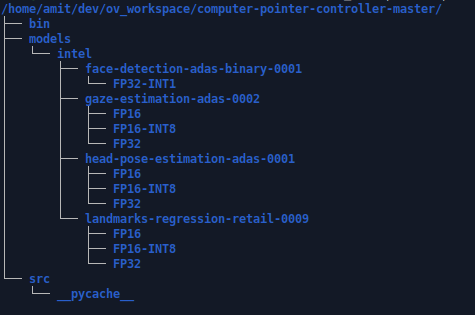

# Computer Pointer Controller

This project, uses a gaze detection model to control the mouse pointer of your computer. You will be using the Gaze Estimation model to estimate the gaze of the user's eyes and change the mouse pointer position accordingly. This project will demonstrate how to run multiple models in the same machine and coordinate the flow of data between those models.

## Project Set Up and Installation
- Directory Structure

- Directory Structure info
	- **NOTE** if you dont see the `models` directory then create it
	- `bin` contains the imput video file, plus other images/media
	- `model` is where you will download the model using the model downloader tool
	- `src` contains all the python files required for the project
- Virtualenvironment setup
	- This step is optional
	- install virtualenvironment
		`pip3 install virtualenv`
	- create a new virtualenvironment
		`python3 -m virtualenv venv`, here `venv` is the name of the virtualenvironment
	- activate the virtualenv
		`source venv/bin/activate`
	- install the dependencies, by first going into the directory containing requirements.txt and then
		`python -m pip install -r requirements.txt`
- Installation requirements
	- Intel Distribution of Open VINO Toolkit, v2020.2
		- Follow [this](https://docs.openvinotoolkit.org/2020.2/_docs_install_guides_installing_openvino_linux.html) guide for successful installtion
	- Python 3.6
		- Python modules in `requirements.txt`
	- [Optional]Deep Learning Workbench for measuring, visualizing, and fine-tuning the performance of different models.
- Setup
	- Clone [this]() repository
	- `cd` into the repository
	- run `pip3 install -r requirements.txt`
	- You will have to download the following models from the Open Vino Model Zoo, into the `models` directory(models directory in the main project directory). This can be done as follows
		- [Facial Detection](https://docs.openvinotoolkit.org/latest/_models_intel_face_detection_adas_binary_0001_description_face_detection_adas_binary_0001.html)
			- use the following command to download the model
				`python3 /opt/intel/openvino/deployment_tools/open_model_zoo/tools/downloader/downloader.py --name face-detection-adas-binary-0001 -o <PATH_TO_models_DIRECTORY>`
		- [Head Pose Estimation](https://docs.openvinotoolkit.org/latest/_models_intel_head_pose_estimation_adas_0001_description_head_pose_estimation_adas_0001.html)
			- `python3 /opt/intel/openvino/deployment_tools/open_model_zoo/tools/downloader/downloader.py --name head-pose-estimation-adas-0001 -o <PATH_TO_models_DIRECTORY>`
		- [Facial Landmark Detection](https://docs.openvinotoolkit.org/latest/_models_intel_landmarks_regression_retail_0009_description_landmarks_regression_retail_0009.html)
			- `python3 /opt/intel/openvino/deployment_tools/open_model_zoo/tools/downloader/downloader.py --name landmarks-regression-retail-0009 -o <PATH_TO_models_DIRECTORY>`
		- [Gaze Estimation Model](https://docs.openvinotoolkit.org/latest/_models_intel_gaze_estimation_adas_0002_description_gaze_estimation_adas_0002.html)
			- `python3 /opt/intel/openvino/deployment_tools/open_model_zoo/tools/downloader/downloader.py --name gaze-estimation-adas-0002 -o <PATH_TO_models_DIRECTORY>`

## Demo
- Running the model on CPU
	- Clone this repository
	- make sure you have all the requirements in the `requirements.txt` file installed. If not run the following command, while in the folder containing the `requirements.txt` file
		`pip3 install -r requirements.txt`
	- `cd` into the `src` directory which contains the `run.py` file
	- Source the Open VINO environment. No need to do this if you have followd [this](https://docs.openvinotoolkit.org/2020.2/_docs_install_guides_installing_openvino_linux.html) guide for installation of Open VINO toolkit, since it automatically sources every time you open a new terminal.
		`source /out/intel/openvino/bin/setupvars.sh -pyver 3.6`
	- Run the following command to run the application
		`python3 run.py -f <path to face detection model's .xml file> -fl <path to facial landmarks detection model's .xml file> -hp <path to head pose detection model's .xml file> -ge <path to gaze estimation model's .xml file> -i <path to input video file, or use cam to use webcam>`
	- Example 
		`python3 run.py -f /home/amit/dev/ov_workspace/starter1/models/intel/face-detection-adas-binary-0001/FP32-INT1/face-detection-adas-binary-0001.xml -fl /home/amit/dev/ov_workspace/starter1/models/intel/landmarks-regression-retail-0009/FP32/landmarks-regression-retail-0009.xml -hp /home/amit/dev/ov_workspace/starter1/models/intel/head-pose-estimation-adas-0001/FP32/head-pose-estimation-adas-0001.xml -ge /home/amit/dev/ov_workspace/starter1/models/intel/gaze-estimation-adas-0002/FP32/gaze-estimation-adas-0002.xml -i /home/amit/dev/ov_workspace/starter1/bin/demo.mp4`
- To run the model on other devices(GPU, VPU, etc) use the `-d` flag to specify the device. See documentation below for all the commandline arguments.
	- To run on GPU you can use 
		`python3 run.py -f /home/amit/dev/ov_workspace/starter1/models/intel/face-detection-adas-binary-0001/FP32-INT1/face-detection-adas-binary-0001.xml -fl /home/amit/dev/ov_workspace/starter1/models/intel/landmarks-regression-retail-0009/FP32/landmarks-regression-retail-0009.xml -hp /home/amit/dev/ov_workspace/starter1/models/intel/head-pose-estimation-adas-0001/FP32/head-pose-estimation-adas-0001.xml -ge /home/amit/dev/ov_workspace/starter1/models/intel/gaze-estimation-adas-0002/FP32/gaze-estimation-adas-0002.xml -i /home/amit/dev/ov_workspace/starter1/bin/demo.mp4 -d GPU`

## Documentation
*TODO:* Include any documentation that users might need to better understand your project code. For instance, this is a good place to explain the command line arguments that your project supports.

## Benchmarks
*TODO:* Include the benchmark results of running your model on multiple hardwares and multiple model precisions. Your benchmarks can include: model loading time, input/output processing time, model inference time etc.
**I could only run the benchmarks on CPU**

- Model Load times
| | face-detection-adas-binary-0001 | head-pose-estimation-adas-0001 | landmarks-regression-retail-0009 | gaze-estimation-adas-0002 |
|--------------------|--------------------|--------------------|--------------------|--------------------|
| Time | 0.22124147415161133 | 0.10043168067932129 | 0.10894560813903809 | 0.13179564476013184 |

## Results
*TODO:* Discuss the benchmark results and explain why you are getting the results you are getting. For instance, explain why there is difference in inference time for FP32, FP16 and INT8 models.

### Edge Cases
There will be certain situations that will break your inference flow. For instance, lighting changes or multiple people in the frame. Explain some of the edge cases you encountered in your project and how you solved them to make your project more robust.
