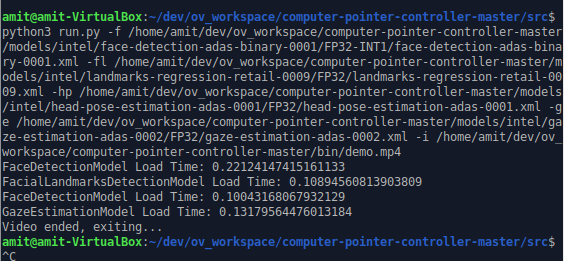
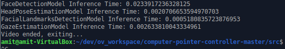
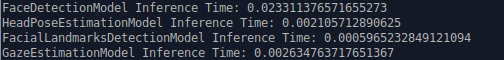
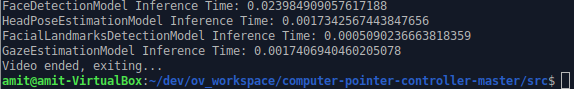
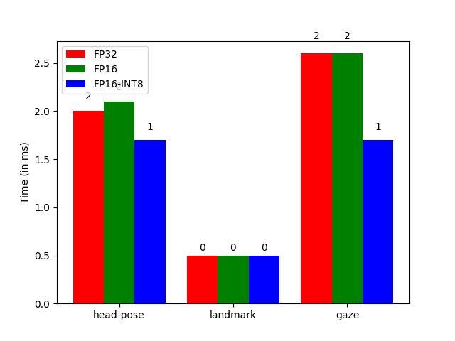

# Computer Pointer Controller

This project, uses a gaze detection model to control the mouse pointer of your computer. You will be using the Gaze Estimation model to estimate the gaze of the user's eyes and change the mouse pointer position accordingly. This project will demonstrate how to run multiple models in the same machine and coordinate the flow of data between those models. The following diagram shows the architecture/model-pipeline

## Project Set Up and Installation
- Directory Structure

- Directory Structure info
	- **NOTE** if you dont see the `models` directory then create it
	- `bin` contains the imput video file, plus other images/media
	- `model` is where you will download the model using the model downloader tool
	- `src` contains all the python files required for the project
- Virtualenvironment setup
	- This step is optional
	- install virtualenvironment
		`pip3 install virtualenv`
	- create a new virtualenvironment
		`python3 -m virtualenv venv`, here `venv` is the name of the virtualenvironment
	- activate the virtualenv
		`source venv/bin/activate`
	- install the dependencies, by first going into the directory containing requirements.txt and then
		`python -m pip install -r requirements.txt`
- Installation requirements
	- Intel Distribution of Open VINO Toolkit, v2020.2
		- Follow [this](https://docs.openvinotoolkit.org/2020.2/_docs_install_guides_installing_openvino_linux.html) guide for successful installtion
	- Python 3.6
		- Python modules in `requirements.txt`
	- [Optional]Deep Learning Workbench for measuring, visualizing, and fine-tuning the performance of different models.
- Setup
	- Clone [this]() repository
	- `cd` into the repository
	- run `pip3 install -r requirements.txt`
	- You will have to download the following models from the Open Vino Model Zoo, into the `models` directory(models directory in the main project directory). This can be done as follows
		- [Facial Detection](https://docs.openvinotoolkit.org/latest/_models_intel_face_detection_adas_binary_0001_description_face_detection_adas_binary_0001.html)
			- use the following command to download the model
				- `python3 /opt/intel/openvino/deployment_tools/open_model_zoo/tools/downloader/downloader.py --name face-detection-adas-binary-0001 -o <PATH_TO_models_DIRECTORY>`
		- [Head Pose Estimation](https://docs.openvinotoolkit.org/latest/_models_intel_head_pose_estimation_adas_0001_description_head_pose_estimation_adas_0001.html)
			- `python3 /opt/intel/openvino/deployment_tools/open_model_zoo/tools/downloader/downloader.py --name head-pose-estimation-adas-0001 -o <PATH_TO_models_DIRECTORY>`
		- [Facial Landmark Detection](https://docs.openvinotoolkit.org/latest/_models_intel_landmarks_regression_retail_0009_description_landmarks_regression_retail_0009.html)
			- `python3 /opt/intel/openvino/deployment_tools/open_model_zoo/tools/downloader/downloader.py --name landmarks-regression-retail-0009 -o <PATH_TO_models_DIRECTORY>`
		- [Gaze Estimation Model](https://docs.openvinotoolkit.org/latest/_models_intel_gaze_estimation_adas_0002_description_gaze_estimation_adas_0002.html)
			- `python3 /opt/intel/openvino/deployment_tools/open_model_zoo/tools/downloader/downloader.py --name gaze-estimation-adas-0002 -o <PATH_TO_models_DIRECTORY>`

## Demo
- Running the model on CPU
	- Clone this repository
	- make sure you have all the requirements in the `requirements.txt` file installed. If not run the following command, while in the folder containing the `requirements.txt` file
		`pip3 install -r requirements.txt`
	- `cd` into the `src` directory which contains the `run.py` file
	- Source the Open VINO environment. No need to do this if you have followd [this](https://docs.openvinotoolkit.org/2020.2/_docs_install_guides_installing_openvino_linux.html) guide for installation of Open VINO toolkit, since it automatically sources every time you open a new terminal.
		- `source /out/intel/openvino/bin/setupvars.sh -pyver 3.6`
	- Run the following command to run the application
		- `python3 run.py -f <path to face detection model's .xml file> -fl <path to facial landmarks detection model's .xml file> -hp <path to head pose detection model's .xml file> -ge <path to gaze estimation model's .xml file> -i <path to input video file, or use cam to use webcam>`
	- Example 
		- `python3 run.py -f /home/amit/dev/ov_workspace/starter1/models/intel/face-detection-adas-binary-0001/FP32-INT1/face-detection-adas-binary-0001.xml -fl /home/amit/dev/ov_workspace/starter1/models/intel/landmarks-regression-retail-0009/FP32/landmarks-regression-retail-0009.xml -hp /home/amit/dev/ov_workspace/starter1/models/intel/head-pose-estimation-adas-0001/FP32/head-pose-estimation-adas-0001.xml -ge /home/amit/dev/ov_workspace/starter1/models/intel/gaze-estimation-adas-0002/FP32/gaze-estimation-adas-0002.xml -i /home/amit/dev/ov_workspace/starter1/bin/demo.mp4`
- To run the model on other devices(GPU, VPU, etc) use the `-d` flag to specify the device. See documentation below for all the commandline arguments.
	- To run on GPU you can use 
		- `python3 run.py -f /home/amit/dev/ov_workspace/starter1/models/intel/face-detection-adas-binary-0001/FP32-INT1/face-detection-adas-binary-0001.xml -fl /home/amit/dev/ov_workspace/starter1/models/intel/landmarks-regression-retail-0009/FP32/landmarks-regression-retail-0009.xml -hp /home/amit/dev/ov_workspace/starter1/models/intel/head-pose-estimation-adas-0001/FP32/head-pose-estimation-adas-0001.xml -ge /home/amit/dev/ov_workspace/starter1/models/intel/gaze-estimation-adas-0002/FP32/gaze-estimation-adas-0002.xml -i /home/amit/dev/ov_workspace/starter1/bin/demo.mp4 -d GPU`

## Documentation
- **Understanding the various models, their input and outputs**
	- Face Detection Model
		- Uses pruned Mobilenet with depthwise convolutions
		- Input Shape: [1x3x385x672], [BxCxHxW]
		- Color space: BGR
		- Output Shape: [1x1xNx7], where N is the number of detected bounding box. Each detection contains the following
			- [image_id, label, conf, x_min, y_min, x_max, y_max]
	- Head Pose Estimataion
		- Uses a custom CNN architecture
		- Input Shape: [1x3x60x60], [1xCxHxW]
		- Color Space: BGR
		- Output: The output layer has 3 units, each represention one of the angles in Tait-Bryan Angles(yaw, pitch & roll)
			- yaw: angle_y_fc
			- pitch: angle_p_fc
			- roll: angle_r_fc
			- all the angles have shape [1, 1] and contains one FP value in degrees
	- Landmark Regression
		- Classic CNN design
		- Input Shape: [1, 3, 48, 48], [B. C. H. W]
		- Color Space: BGR
		- Outputs: Row vector of shape [1, 10] containing coordinates of the landmark of 2 eyes, 1 nose and 2 mouth
	- Gaze Detection
		- 3 Inputs
			- square crop of left eye image, [1,3, 60, 60]
			- square crop of right eye image, [1,3, 60, 60], both from Face detection and Landmark regression
			- 3 head pose angles: (yaw, pitch, roll), [1, 3], from Head Pose Estimation model
		- Output: [1, 3] shape blob, containing coordinates of the gaze detection vectors

- **Understanding the command line arguments**
	- The app supports the following command line arguments
		- `-f`: specified the path of the face-detection model's .xml file
		- `-fl`: specified the path of the facial-landmark-detection model's .xml file
		- `-hp`: specified the path of the head-posr-estimation model's .xml file
		- `-ge`: specified the path of the gaze-estimation model's .xml file
		- `-i`: specifies the path to the input video file. If you are using the webcam for live feed, then set the value of this flag to _cam_
		- `-p`: specify the probability threshold for face detection model
		- `-d`: specify the target device, i.e. the device the models will run inference on, possible values CPU, GPU, VPU, MYRIAD etc.

## Benchmarks

**Benchmarks for CPU only**

- **Model Load Time FP32**
	- NOTE
		- face-detection model only available in FP32

| | face-detection-adas-binary-0001 | head-pose-estimation-adas-0001 | landmarks-regression-retail-0009 | gaze-estimation-adas-0002 |
|--------------------|--------------------|--------------------|--------------------|--------------------|
| Time | 0.22124147415161133 | 0.10043168067932129 | 0.10894560813903809 | 0.13179564476013184 |

- **Inference Time Per Image/Frame FP32**

| | face-detection-adas-binary-0001 | head-pose-estimation-adas-0001 | landmarks-regression-retail-0009 | gaze-estimation-adas-0002 |
|--------------------|--------------------|--------------------|--------------------|--------------------|
| Time | 0.0233917236328125 | 0.0020706653594970703 | 0.0005180835723876953 | 0.002633810043334961 |

- **Inference Time Per Image/Frame FP16**

| | face-detection-adas-binary-0001 | head-pose-estimation-adas-0001 | landmarks-regression-retail-0009 | gaze-estimation-adas-0002 |
|--------------------|--------------------|--------------------|--------------------|--------------------|
| Time | 0.023311376571655273 | 0.002105712890625 | 0.0005965232849121094 | 0.002634763717651367 |

- **Inference Time Per Image/Frame INT8**

| | face-detection-adas-binary-0001 | head-pose-estimation-adas-0001 | landmarks-regression-retail-0009 | gaze-estimation-adas-0002 |
|--------------------|--------------------|--------------------|--------------------|--------------------|
| Time | 0.023984909057617188 | 0.0017342567443847656 | 0.0005090236663818359 | 0.0017406940460205078 |

## Results
- face-detection model takes more time than the rest of the models for inference.
- inference time for FP16 and FP32 are very similar
- Using FP16-INT8 gives _sight improvemnt_ in inference times.
- The following graph shows the inference times for a single image when using different precision

### Edge Cases

- If the position of the landmarks is not visible in the frame, the landmark detection model will not detect  anthing and the app will exit
- For multiple faces, the facedetection model selects the one which was identified first
